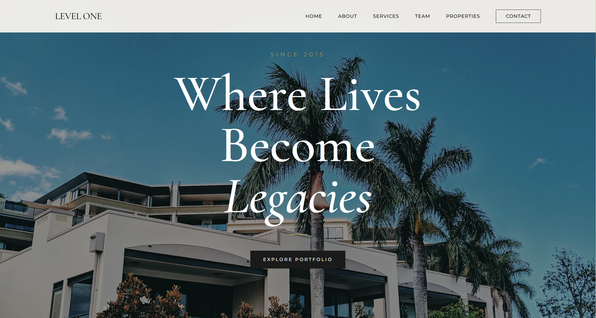
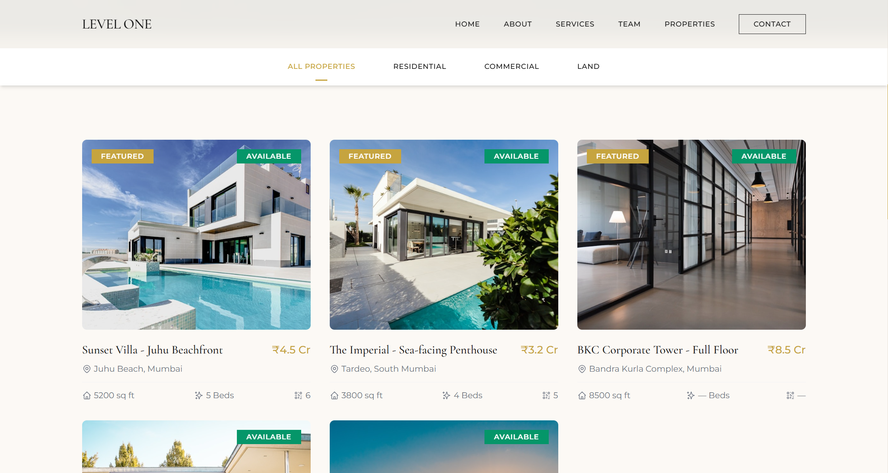
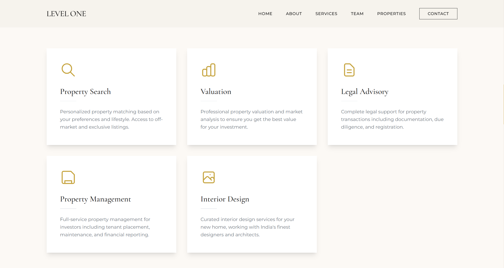
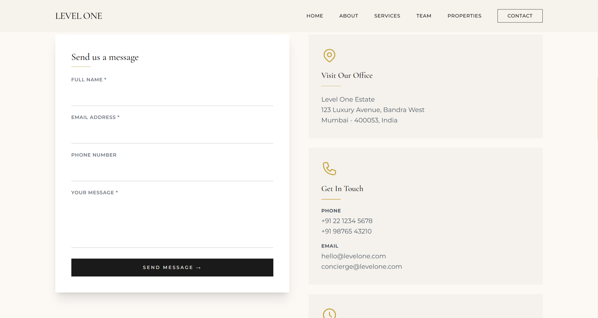
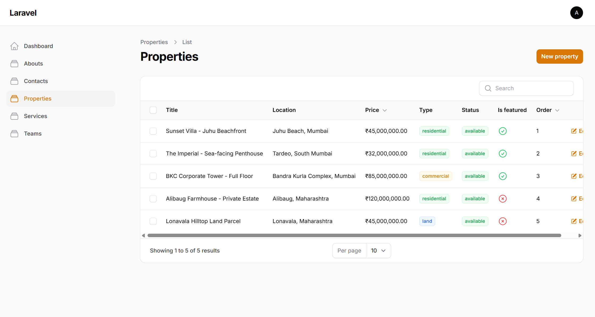

Level One Estate - Luxury Real Estate Website
=============================================

A premium, fully-featured real estate website template built with Laravel 11 and Filament 3.

Screenshots 
--------

### Homepage



### Properties



### Services



### Contact



### Admin



Features
--------

*   Luxury responsive design
    
*   Complete admin panel (Filament)
    
*   Team member management
    
*   Services management
    
*   Property listings with image gallery
    
*   Contact form with database storage
    
*   Featured properties section
    
*   Property filtering by type
    
*   SEO-friendly URLs
    
*   Mobile optimized
    

Tech Stack
----------

*   Laravel 11
    
*   Filament 3
    
*   Tailwind CSS
    
*   MySQL
    
*   Alpine.js
    

Requirements
------------

*   PHP 8.1+
    
*   Composer
    
*   Node.js 18+
    
*   MySQL 5.7+
    

Quick Installation
------------------

```bash
# Clone the repository
git clone https://github.com/YOUR_USERNAME/levelone-estate.git
cd levelone-estate

# Install dependencies
composer install
npm install

# Environment setup
cp .env.example .env
php artisan key:generate

# Database setup (edit .env first)
php artisan migrate

# Create admin user
php artisan make:filament-user

# Storage link for images
php artisan storage:link

# Compile assets (keep this running)
npm run dev

# Start the server (in another terminal)
php artisan serve

```

Access
------

*   Frontend: `http://127.0.0.1:8000`
    
*   Admin: `http://127.0.0.1:8000/admin`
    

Folder Structure
----------------

text

├── app/
│   ├── Filament/        # Admin panel resources
│   ├── Http/            # Controllers
│   └── Models/          # Database models
├── database/
│   └── migrations/      # Database schema
├── resources/
│   └── views/           # Blade templates
├── routes/
│   └── web.php          # Application routes
└── public/
    └── storage/         # Uploaded images

Customization
-------------

Edit `tailwind.config.js` to change colors:

```javascript

colors: {
    gold: '#C6A43F',
    cream: '#FCF9F5',
    charcoal: '#1A1A1A',
}

```

License
-------

MIT

Support
-------

For questions or customizations, contact the developer.